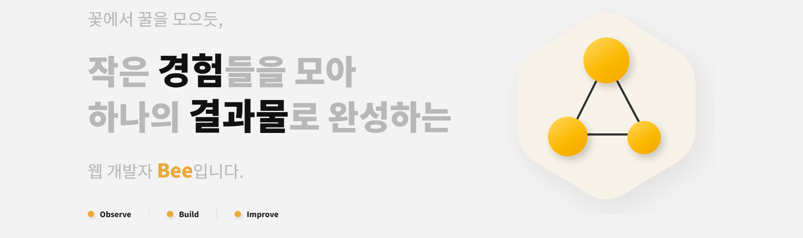

<br />

<div align="center">

# 🐝 Bee Portfolio

### 꽃에서 꿀을 모으듯,  
### 작은 경험들을 모아 하나의 결과물로 완성하는  
### 웹 개발자 **Bee**입니다.

<br />

**🟡 Observe &nbsp;&nbsp;·&nbsp;&nbsp; 🟡 Build &nbsp;&nbsp;·&nbsp;&nbsp; 🟡 Improve**

<br />

<a href="https://bee0701.github.io/P-P/">
  
</a>
<a href="https://github.com/bee0701">
  
</a>

</div>

<br />

---

<br />

## 🖼 Preview

<p align="center">
 
</p>

<br />

---

## 🐝 About

Bee Portfolio는 저를 소개하기 위해 제작한 개인 포트폴리오 웹사이트입니다.  
Bee라는 브랜딩을 바탕으로 **경험, 관찰, 구현, 개선**이라는 흐름을 시각적으로 표현했습니다.

React 기반으로 컴포넌트 구조를 설계하고,  
반응형 레이아웃, SVG 심볼, 스크롤 애니메이션, 프로젝트 링크, Contact 기능을 구현했습니다.

<br />

---

## 🛠 Tech Stack

<p>
  
  
  
  
  
  
</p>

<br />

---

## ✨ Key Features

| Feature | Description |
|---|---|
| 🟡 Responsive Web | 모바일, 태블릿, 데스크탑에 맞춘 반응형 레이아웃 |
| 🟡 SVG Branding | Bee 컨셉과 연결되는 노드 심볼 구현 |
| 🟡 Scroll Animation | 섹션 진입 시 자연스럽게 등장하는 애니메이션 |
| 🟡 Project Showcase | 실제 작업한 프로젝트와 배포 링크 연결 |
| 🟡 Contact | 이메일 및 GitHub로 연결되는 Contact 영역 |

<br />

---

## 📁 Project Structure

```bash
P-P/
├── public/
│   └── favicon.png
├── images/
│   └── preview.png
├── src/
│   ├── assets/
│   │   └── images/
│   ├── component/
│   │   ├── Home.jsx
│   │   ├── About.jsx
│   │   ├── Experience.jsx
│   │   ├── Developer.jsx
│   │   └── Project.jsx
│   ├── hooks/
│   │   └── useScrollAnimation.js
│   ├── styles/
│   ├── App.jsx
│   └── main.jsx
├── index.html
├── package.json
└── vite.config.js
